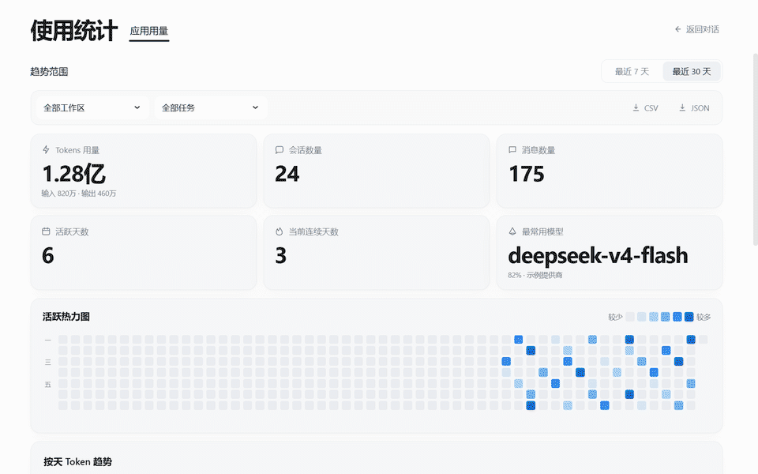

# 📊 dsh-usage-stats

[简体中文](./README.md)

> DeepSeek Harness token usage at a glance.

[](https://www.npmjs.com/package/dsh-usage-stats)
[](https://www.npmjs.com/package/dsh-usage-stats)
[](https://github.com/lanlandeli/dsh-usage-stats/actions)
[](https://nodejs.org)
[](./LICENSE)

dsh-usage-stats is a lightweight usage analytics plugin for the DeepSeek Harness Web UI. It presents lifetime token totals, daily trends, activity dates, and model distribution in one dashboard.

The plugin integrates through Harness extension APIs without modifying the Web UI or official npm packages. Statistics remain on the local machine.

```sh
dsh plugin --profile web add dsh-usage-stats
```

Restart the Web profile and open **Usage Statistics** above Settings in the sidebar.

Update or remove the plugin:

```sh
dsh plugin --profile web update dsh-usage-stats
dsh plugin --profile web remove dsh-usage-stats
```

## Demo



## Screenshots

<details>
<summary>View light theme</summary>


</details>

<details>
<summary>View dark theme</summary>


</details>

## Features

| Module | Description |
| --- | --- |
| **Overview** | Lifetime token, session, message, active-day, streak, and top-model totals |
| **Daily trends** | Recent 7-day or 30-day token usage with per-model hover details |
| **Activity heatmap** | One year of activity levels with daily token and call details |
| **Scope filters** | Filter by workspace, main task, or subtask |
| **Call details** | Paginated per-call list with response time, input/output tokens, cache hit rate, model, and reasoning effort; filter by model/provider/token threshold and switch page size |
| **Data export** | Export CSV or JSON for archival or further analysis |
| **Chinese and English UI** | Follow the Harness language setting automatically |
| **Theme support** | Follow the Harness light or dark theme automatically |
| **Lightweight runtime** | No third-party charting library and no background polling |

## Fixed

### Inherited parent context counted as subtask usage

`0.1.13` fixed an issue where forked subtasks attributed inherited parent context to their own usage. Subtasks now count only calls they produced themselves; after upgrading, statistics cached by older versions are invalidated and rebuilt using the corrected definition.

## Configuration

```yaml
config:
  indexConcurrency: 2
  cacheWriteDelayMs: 1000
  apiPath: /usage-stats/v1
```

| Option | Description | Default |
| --- | --- | --- |
| `indexConcurrency` | Number of historical sessions read concurrently (`1`–`8`) | `2` |
| `cacheWriteDelayMs` | Delay before updating the local index, in milliseconds | `1000` |
| `cachePath` | Custom index location | Harness data directory |
| `apiPath` | Statistics API path | `/usage-stats/v1` |

## Privacy and security

- The local index is stored in `DSH_HOME/usage-stats` and contains session identifiers, timestamps, working directories, model names, and token counts.
- The plugin does **not** retain prompts, responses, tool arguments, or API keys.
- See the [privacy policy](./PRIVACY.md) for the exact data scope.

## Compatibility

The verified baseline is DeepSeek Harness `0.1.0-rc.6` with Node.js `22.19+` or `24+`. The plugin supports the official Web UI and desktop wrappers that load it.

Harness is evolving rapidly. Only environments tested by this project are declared as verified. See [Compatibility](./docs/COMPATIBILITY.md) for details.

## Issues

For a missing plugin entry, incomplete statistics, display errors, or version compatibility problems, [submit an Issue](https://github.com/lanlandeli/dsh-usage-stats/issues/new) with the Harness and Node.js versions, installation command, reproduction steps, and relevant logs or screenshots.

Do not include API keys, access tokens, or private local data in a public Issue. See the [security policy](./SECURITY.md) for vulnerability reporting.

## Acknowledgements

- Thanks to [@Grivn](https://github.com/Grivn) for identifying and analyzing inherited parent context being counted as subtask usage in [#1](https://github.com/lanlandeli/dsh-usage-stats/pull/1).
- Thanks to [@yzke](https://github.com/yzke) for proposing and implementing the Chinese and English UI adaptation in [#2](https://github.com/lanlandeli/dsh-usage-stats/pull/2).

## License

[MIT](./LICENSE)
