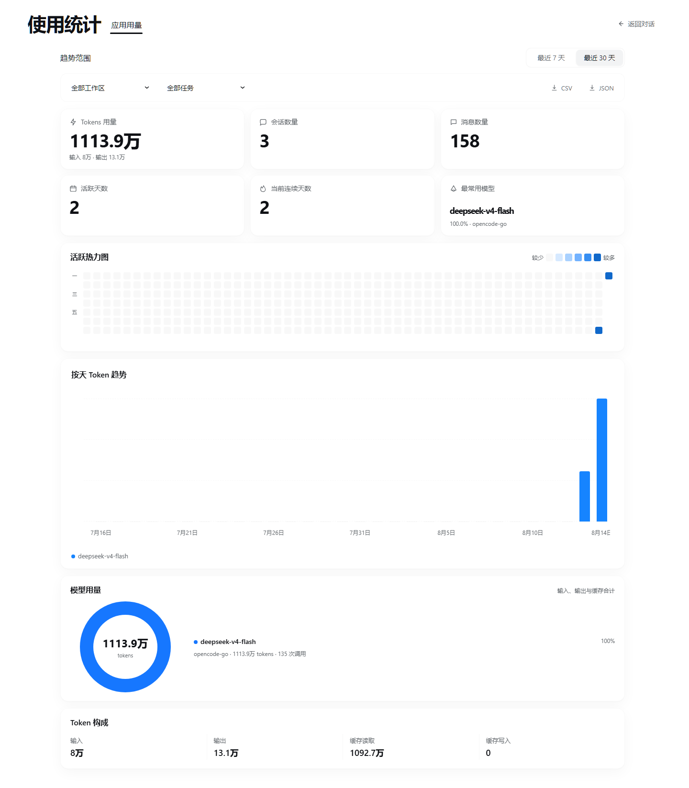
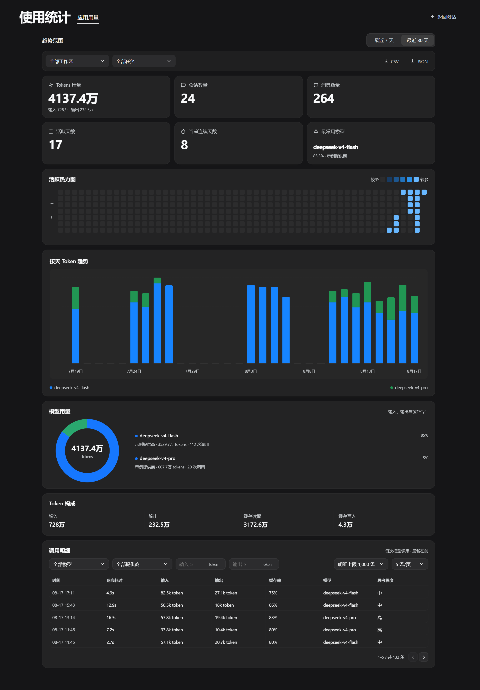

# dsh-usage-stats

[简体中文](./README.md)

Beautiful token analytics for DeepSeek Harness: lifetime totals, recent token
trends, an activity heatmap, model breakdowns, workspace/task filters, and
CSV/JSON exports — all integrated through the official Web UI slots.



<details>
<summary>Dark theme</summary>



</details>

## Install

```sh
dsh plugin --profile web add dsh-usage-stats
```

Restart the Web profile, then open **Usage Statistics** above Settings in the
sidebar. To upgrade or remove it:

```sh
dsh plugin --profile web update dsh-usage-stats
dsh plugin --profile web remove dsh-usage-stats
```

## Highlights

- Lifetime token, session, message, active-day, streak, and top-model totals.
- 7-day and 30-day token trends with per-model hover details.
- One-year activity heatmap with daily token/call details.
- Workspace and main/subtask filtering.
- Light, dark, and system theme support.
- Same-origin, read-only CSV and JSON exports.
- No charting runtime dependency and no background polling.

## Privacy

The index is local to `DSH_HOME/usage-stats`. It stores session identifiers,
timestamps, working-directory labels, provider/model identifiers, and token
counters. It does not retain prompt text, response text, tool arguments, or API
keys. See [PRIVACY.md](./PRIVACY.md) for the complete data-flow description.

## Compatibility

The verified baseline is DeepSeek Harness `0.1.0-rc.6` with Node.js `22.19+`
or `24+`, on the Web UI and desktop wrappers that load it. Harness is currently
in developer preview, so every release is tested against the declared baseline
instead of promising compatibility with untested future builds. See
[Compatibility](./docs/COMPATIBILITY.md).

The Host side only consumes `sessionQuery`, `session/event`, and `webServer`.
The browser side uses the public `sidebar.footer.action` and `shell.overlay`
slots; it does not query or mutate Harness DOM nodes.

## Configuration

```yaml
config:
  indexConcurrency: 2
  cacheWriteDelayMs: 1000
  apiPath: /usage-stats/v1
```

- `indexConcurrency`: bounded historical-session readers (`1`–`8`).
- `cacheWriteDelayMs`: debounce for atomic local cache writes.
- `cachePath`: optional custom index location.
- `apiPath`: same-origin read-only API prefix.

## Metric definitions

- Total tokens = input + output + cache reads + cache writes.
- Overview cards are lifetime totals for the selected workspace/task scope.
- Trend charts cover the selected recent 7/30-day window.
- Messages are direct human messages plus assembled assistant replies.
- No price or cost estimation is performed.

## Development

```sh
npm ci
npm run check
npm run pack:check
```

The clean-profile smoke test installs, boots, queries, and removes the packed
plugin in an isolated temporary `DSH_HOME`:

```sh
npm run smoke:clean-profile
```

See [CONTRIBUTING.md](./CONTRIBUTING.md), [SECURITY.md](./SECURITY.md), and
[CHANGELOG.md](./CHANGELOG.md).

## License

MIT
